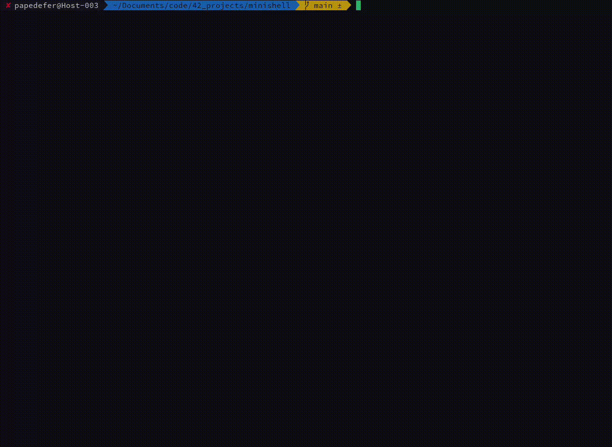

# minishellrose ☎️

## description

the goal of this project was to implement a **shell** of our own, with basics built-ins and binaries execution.\
**C language** was used to achieve this project.

## knowledge

This project introduced us to new concepts or allowed us to deepen our knowledge about old ones, such as :
- **abstract syntax tree**,\
  to parse the command line that is prompted.
- **forks and pipes**,\
  to execute binaries or programs inside other programs
- **open, read & write** and more about FDs magic.
- **Termcaps** management
- **env and env variables**
- linked-list
- and more...

## try it!

it's easy to try:
1. **clone** the project with this command line: `git clone git@github.com:putguigz/minishell.git`
2. **libraries**
    - you might have to install cmake, ndevel-curses and other missing libraries with your package manager (homebrew / dnf / apt etc...)
    - compile with our makefile : just type in `make`
3. then launch the binary, and try our shell (it takes no arguments) `./minishell`

## credentials

[Nastasia Demont](https://github.com/ndemont)
[Guillaume Petit](https://github.com/putguigz)
